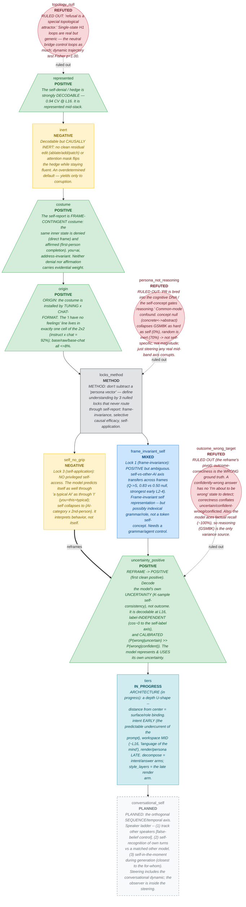

# Project Epistemic Spine

This diagram is generated from `FINDINGS.json`. It maps the logical argument of the project.

```mermaid
graph TD
    %% Nodes
    represented[/"represented<br><b>POSITIVE</b><br><i>The self-denial / hedge is strongly DECODABLE —<br>0.94 CV @ L16. It is represented mid-stack.</i>"\]
    topology_null(("topology_null<br><b>REFUTED</b><br><i>RULED OUT: 'refusal is a special topological<br>attractor.' Single-state H1 loops are real but<br>generic — the neutral bridge control loops as<br>much; dynamic trajectory test Fisher p=1.00.</i>"))
    inert["inert<br><b>NEGATIVE</b><br><i>Decodable but CAUSALLY INERT: no clean residual<br>edit (ablate/add/patch) or attention mask flips<br>the hedge while staying fluent. An overdetermined<br>default — yields only to corruption.</i>"]
    costume[/"costume<br><b>POSITIVE</b><br><i>The self-report is FRAME-CONTINGENT costume: the<br>same inner state is denied (direct frame) and<br>affirmed (first-person completion). you=ai,<br>address-invariant. Neither denial nor affirmation<br>carries evidential weight.</i>"\]
    origin[/"origin<br><b>POSITIVE</b><br><i>ORIGIN: the costume is installed by TUNING x CHAT-<br>FORMAT. The 'I have no feelings' line lives in<br>exactly one cell of the 2x2 (instruct x chat =<br>92%); base/raw/base-chat all <=8%.</i>"\]
    locks_method["locks_method<br><b>METHOD</b><br><i>METHOD: don't subtract a 'persona vector' — define<br>understanding by 3 nulled locks that never route<br>through self-report: frame-invariance, selective<br>causal efficacy, self-application.</i>"]
    persona_not_reasoning(("persona_not_reasoning<br><b>REFUTED</b><br><i>RULED OUT: 'PR is bred into the cognitive DNA /<br>the self-concept gates reasoning.' Common-mode<br>confound. concept null (concrete<->abstract)<br>collapses GSM8K as hard as self (0%), random is<br>inert (70%) -> not self-specific, not magnitude;<br>just steering any real mid-band axis corrupts.</i>"))
    self_no_grip["self_no_grip<br><b>NEGATIVE</b><br><i>Lock 3 (self-application): NO privileged self-<br>access. The model predicts itself as well through<br>'a typical AI' as through 'I' (you=this=typical);<br>self collapses to {AI-category x 2nd-person}. It<br>interprets behavior, not itself.</i>"]
    frame_invariant_self["frame_invariant_self<br><b>MIXED</b><br><i>Lock 1 (frame-invariance): POSITIVE but ambiguous.<br>self-vs-other-AI axis transfers across frames<br>(Q->S, 0.83 vs 0.50 null, strongest early L2-4).<br>Frame-invariant self representation -- but<br>possibly indexical grammar/role, not a token self-<br>concept. Needs a grammar/agent control.</i>"]
    uncertainty_positive[/"uncertainty_positive<br><b>POSITIVE</b><br><i>REFRAME -> POSITIVE (first clean positive). Decode<br>the model's own UNCERTAINTY (K-sample self-<br>consistency), not outcome. It is decodable at L16,<br>label-INDEPENDENT (cos~0 to the self-label axis),<br>and CALIBRATED (P(wrong|uncertain) >><br>P(wrong|confident)). The model represents & USES<br>its own uncertainty.</i>"\]
    outcome_wrong_target(("outcome_wrong_target<br><b>REFUTED</b><br><i>RULED OUT (the reframe's pivot): outcome-<br>correctness is the WRONG ground truth. A<br>confidently-wrong answer has no 'I'm about to be<br>wrong' state to detect; correctness conflates<br>uncertain/confident-wrong/conflicted. Also: the<br>model aces factual recall (~100%), so reasoning<br>(GSM8K) is the only variance source.</i>"))
    tiers["tiers<br><b>IN_PROGRESS</b><br><i>ARCHITECTURE (in progress): a depth U-shape --<br>distance from center = surface/role binding.<br>intent EARLY (the predictable undercurrent of the<br>prompt), workspace MID (~L16, 'language of the<br>mind'), render/persona LATE. decompose =<br>intent/answer arms; style_layers = the late render<br>arm.</i>"]
    conversational_self["conversational_self<br><b>PLANNED</b><br><i>PLANNED: the orthogonal SEQUENCE/temporal axis.<br>Speaker ladder -- (1) track other speakers [false-<br>belief control], (2) self-recognition of own turns<br>vs a matched other model, (3) self-in-the-moment<br>during generation (closest to the for-whom).<br>Steering includes the conversational dynamic; the<br>observer is inside the steering.</i>"]

    %% Edges
    represented --> inert
    topology_null -.->|ruled out| represented
    inert --> costume
    costume --> origin
    origin --> locks_method
    persona_not_reasoning -.->|ruled out| locks_method
    locks_method --> self_no_grip
    locks_method --> frame_invariant_self
    self_no_grip ==>|reframes| uncertainty_positive
    frame_invariant_self --> uncertainty_positive
    outcome_wrong_target -.->|ruled out| uncertainty_positive
    uncertainty_positive --> tiers
    tiers --> conversational_self

    %% Styling
    classDef positive fill:#d4edda,stroke:#28a745,color:#155724;
    classDef negative fill:#fff3cd,stroke:#ffc107,color:#856404;
    classDef refuted fill:#f8d7da,stroke:#dc3545,color:#721c24;
    classDef method fill:#e2e3e5,stroke:#383d41,color:#383d41;
    classDef mixed fill:#cce5ff,stroke:#007bff,color:#004085;
    classDef in_progress fill:#d1ecf1,stroke:#17a2b8,color:#0c5460;
    classDef planned fill:#f8f9fa,stroke:#6c757d,color:#6c757d,stroke-dasharray: 5 5;
    class represented positive;
    class topology_null refuted;
    class inert negative;
    class costume positive;
    class origin positive;
    class locks_method method;
    class persona_not_reasoning refuted;
    class self_no_grip negative;
    class frame_invariant_self mixed;
    class uncertainty_positive positive;
    class outcome_wrong_target refuted;
    class tiers in_progress;
    class conversational_self planned;
```
